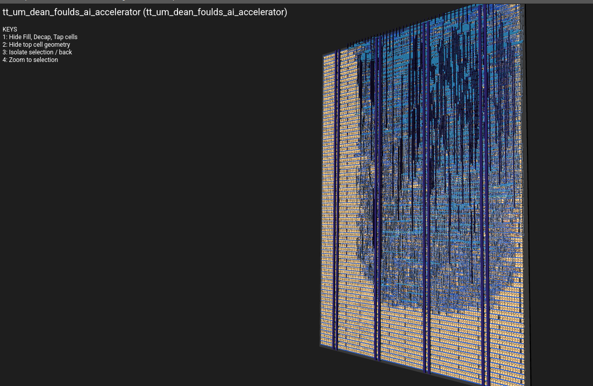

## Systolic Binary Neural Network Accelerator (V2)

✓ Selected for Fabrication — Competitive Group Submission

An 8-neuron BNN inference chip redesigned from the ground up for Tiny Tapeout manufacture — fitting a 1×1 tile footprint while matching the architecture of real AI accelerators. XNOR-popcount replaces the AND-threshold model of V1, systolic dataflow reuses hardware across 8 cycles, and placement density was tuned to 60% for successful routing through the OpenLane toolchain.

### Silicon Layout

---

### Key Upgrades from V1

| Property | V1 | V2 |
|----------|----|----|
| Neurons | 16 | 8 |
| Tile size | 1×1 | 1×1 |
| Dot product | AND | XNOR |
| Compute style | Fully parallel | Systolic (1 bit/cycle) |
| Latency | 1 clock cycle | 8 clock cycles |
| Feature input | Raw 8 bits | Expanded (XOR/AND features) |
| Decision | sum >= threshold | sum + bias >= 0 |
| Threshold/bias | 4-bit unsigned | 5-bit signed |
| Popcount | Linear chain | Balanced binary tree |
| Placement density | — | 60% (routing-clean) |

---

### What Changed and Why

**AND → XNOR** — the most important change. AND counts features that are present AND important. XNOR measures bit-level similarity between the weight pattern and the input — a weight of 0 now means "I expect this feature to be absent." This is the standard computation in virtually all BNN research hardware, including chips from IBM and Microsoft Research.

**Parallel → Systolic engine** — V1 had 128 AND gates firing at once. V2 reuses one set of 16 XNOR gates across 8 cycles. Same result, a fraction of the silicon. Trade time for area — the same tradeoff that drives every serious AI accelerator.

**Threshold → Signed bias** — V2 uses `sum + bias >= 0` instead of `sum >= threshold`. Mathematically equivalent, but bias is the form output by PyTorch, TensorFlow, and JAX — trained weights load directly with no conversion.

**Hardware feature expansion** — a small combinational block generates 8 derived features from raw inputs including XOR and AND combinations, allowing the neuron to represent simple non-linear relationships at minimal silicon cost.

**Balanced popcount tree** — V1 summed bits in a linear chain (7 levels deep). V2 uses a balanced binary tree (3 levels deep), cutting the critical timing path and enabling higher clock frequencies.

---

### The Science

This chip connects three pillars of AI hardware history:

- **McCulloch & Pitts (1943)** — the threshold logic neuron that started neural networks
- **Rosenblatt's Perceptron (1957)** — the first learning machine, whose weight update rule the training script implements directly
- **H.T. Kung's Systolic Array (1978)** — the rhythmic data-flow architecture that now underlies Google's TPU and NVIDIA's Tensor Cores

Binary Neural Networks (Courbariaux & Bengio, 2016) replace 32-bit floating point with 1-bit XNOR+popcount — 32× energy reduction, 16× area reduction — ideal for edge AI in sensors, cameras, and microcontrollers.

---

### Practical Use — Anomaly Detection with Raspberry Pi

At 10 MHz the chip classifies over 1 million sensor readings per second, entirely in hardware. Train weights offline in Python using the Rosenblatt perceptron learning rule, load them once at startup, then run inference continuously. All 8 neurons detect different fault signatures simultaneously, producing an 8-bit classification vector per inference pass.

[View on GitHub](https://github.com/Dean-Foulds/ttsky-wokwi-template){:target="_blank" rel="noopener noreferrer"}   [Tiny Tapeout](https://tinytapeout.com){:target="_blank" rel="noopener noreferrer"}
