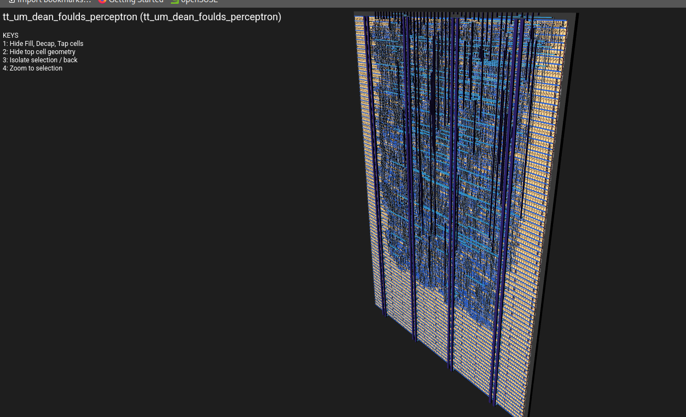

## 16-Neuron Binary Neural Network

A **Binary Neural Network (BNN) inference layer** implemented directly in silicon on a Tiny Tapeout tile. 16 independent binary perceptron neurons each classify the same 8-bit input vector simultaneously, producing a 16-bit output in a single clock cycle — with no CPU, no software, no operating system.


### Silicon Layout

The image below shows the actual physical layout of the 16-neuron BNN as it will be etched into silicon — generated by the OpenLane ASIC toolchain for Tiny Tapeout.



---
### The Mathematical Model

Each neuron `n` computes:
```
y[n] = 1   if   Σ( w[n][i] AND x[i] ) >= θ[n]
y[n] = 0   otherwise
```

Because all values are binary, multiplication reduces to a logical AND — orders of magnitude cheaper in silicon area and power than floating-point arithmetic.

### Inside Each Neuron

**Stage 1 — AND Array:** Each input bit is ANDed with its corresponding weight bit in parallel across 8 gates.

**Stage 2 — Adder Tree (Popcount):** The 8 product bits are summed using a tree of half-adders and full-adders, producing a 4-bit count S[n] between 0 and 8.

**Stage 3 — Threshold Comparator:** If S[n] >= θ[n], the neuron fires. A single bit — yes or no.

### Why 16 Neurons in Parallel?

All 16 neurons share the same 8-bit input bus but each has its own independent weight register (8 bits) and threshold register (4 bits). Each can be programmed to recognise a different pattern. The result is a 16-bit output vector answering 16 different yes/no questions about the input simultaneously.

### Why this is genuinely AI

This implements the McCulloch-Pitts neuron (1943) — the mathematical model that founded neural networks. Every modern AI system is built from billions of this computation. BNNs are an active research area for ultra-low-power AI inference at the edge, where AND+popcount replaces expensive multiply-accumulate operations.

### Weights can be trained in Python
```python
from perceptron_trainer import train_perceptron, generate_load_instructions
import numpy as np

X = np.random.randint(0, 2, (200, 8))
y = (X.sum(axis=1) > 4).astype(int)

weights, threshold, _ = train_perceptron(X, y, epochs=100)
generate_load_instructions(weights, threshold)
```

### Pin Mapping

| Pin | Direction | Function |
|-----|-----------|----------|
| `clk` | in | System clock |
| `rst_n` | in | Active-low reset |
| `ui_in[7:0]` | in | Input features or load data |
| `uio_in[0]` | in | Mode: 0=load, 1=infer |
| `uio_in[1]` | in | Target: 0=weights, 1=thresholds |
| `uio_in[5:2]` | in | Neuron select 0–15 |
| `uo_out[7:0]` | out | Fire signals neurons 0–7 |
| `uio_out[7:0]` | out | Fire signals neurons 8–15 |

[View on GitHub](https://github.com/Dean-Foulds/ttsky-wokwi-template){:target="_blank" rel="noopener noreferrer"}

[Tiny Tapeout](https://tinytapeout.com){:target="_blank" rel="noopener noreferrer"}
